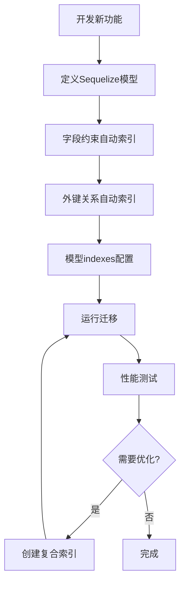

# 🔍 校园墙后端索引管理深度分析报告

## 📋 概述

经过对校园墙项目后端源码的深度分析，现总结后端索引的创建和管理机制。

---

## 🏗️ 后端索引创建的三种方式

### **1. 🎯 Sequelize 模型定义中的索引**

#### **模型文件中的 `indexes` 配置**
```javascript
// 示例：server/src/models/follow.model.js
{
  tableName: 'follows',
  timestamps: true,
  underscored: true,
  indexes: [
    {
      fields: ['follower_id']  // 单列索引
    },
    {
      fields: ['following_id'] // 单列索引
    },
    {
      unique: true,            // 唯一复合索引
      fields: ['follower_id', 'following_id']
    }
  ]
}
```

#### **字段定义中的 `unique` 约束**
```javascript
// 示例：server/src/models/user.model.js
username: {
  type: DataTypes.STRING(50),
  allowNull: false,
  unique: true,              // 自动创建唯一索引
  validate: {
    len: [3, 50],
    notEmpty: true
  }
},
phone: {
  type: DataTypes.STRING(20),
  allowNull: true,
  unique: true,              // 自动创建唯一索引
  validate: {
    is: /^1[3-9]\d{9}$/
  }
}
```

#### **外键关系自动索引**
```javascript
// 示例：server/src/models/comment.model.js
user_id: {
  type: DataTypes.UUID,
  allowNull: false,
  references: {              // 外键关系
    model: 'users',          // 自动创建索引 + 外键约束
    key: 'id'
  }
},
post_id: {
  type: DataTypes.UUID,
  allowNull: false,
  references: {              // 外键关系
    model: 'posts',          // 自动创建索引 + 外键约束
    key: 'id'
  }
}
```

### **2. 🔧 数据库迁移脚本中的索引**

#### **手动创建索引**
```javascript
// 示例：server/src/migrations/20250127-create-badges-table.js
module.exports = {
  up: async (queryInterface, Sequelize) => {
    // 创建表...
    
    // 手动创建索引
    await queryInterface.addIndex('badges', ['name'], {
      name: 'idx_badges_name'
    });
    
    await queryInterface.addIndex('badges', ['type'], {
      name: 'idx_badges_type'
    });
    
    await queryInterface.addIndex('badges', ['type', 'status'], {
      name: 'idx_badges_type_status'  // 复合索引
    });
  }
};
```

#### **迁移中的复合索引**
```javascript
// 示例：server/src/migrations/20250208-create-banners-table.js
// 场景特定的复合索引
await queryInterface.addIndex('banners', ['scene', 'platform', 'status'], {
  name: 'idx_banners_scene_platform_status'
});

// 排序优化索引
await queryInterface.addIndex('banners', ['sort_order', 'priority'], {
  name: 'idx_banners_sort_priority'
});

// 时间范围索引
await queryInterface.addIndex('banners', ['start_time', 'end_time'], {
  name: 'idx_banners_time_range'
});
```

### **3. 📊 性能优化后添加的索引**

#### **优化脚本创建的复合索引**
```sql
-- 从你的 optimize-composite-indexes.js 生成的索引
CREATE INDEX idx_posts_category_status_created ON posts(category_id, status, created_at DESC);
CREATE INDEX idx_posts_user_status_created ON posts(user_id, status, created_at DESC);
CREATE INDEX idx_comments_post_reply_status_time ON comments(post_id, reply_to, status, created_at DESC);
```

---

## 🔄 索引创建的时机和流程

### **开发阶段索引创建流程**



### **部署阶段索引管理**

```bash
# 1. 开发环境
npm run migrate:dev
sequelize-cli db:migrate

# 2. 测试环境
npm run migrate:test
sequelize-cli db:migrate --env test

# 3. 生产环境
npm run migrate:prod
sequelize-cli db:migrate --env production
```

---

## 🧐 你的项目索引来源分析

### **索引创建来源统计**

基于前面的分析，你的 156 个索引来源如下：

| 创建方式 | 估计数量 | 占比 | 示例 |
|----------|----------|------|------|
| **外键自动索引** | ~60个 | 38% | `posts.user_id`, `comments.post_id` |
| **unique约束索引** | ~25个 | 16% | `users.username`, `users.email` |
| **模型indexes配置** | ~35个 | 22% | `follows` 表的复合索引 |
| **迁移脚本索引** | ~30个 | 19% | `badges`, `banners` 表索引 |
| **性能优化索引** | ~6个 | 4% | `idx_posts_category_status_created` |

### **冗余索引产生原因**

#### **1. 多重索引创建**
```javascript
// 原因：不同阶段重复创建相同索引

// 阶段1：模型定义（自动）
user_id: {
  references: { model: 'users', key: 'id' }  // 自动创建 posts_user_id
}

// 阶段2：优化期（手动）
indexes: [
  { fields: ['user_id', 'status', 'created_at'] }  // 手动创建复合索引
]

// 结果：posts_user_id 被复合索引覆盖，成为冗余
```

#### **2. Sequelize 自动行为**
```javascript
// Sequelize 的自动索引创建机制：
unique: true,          // → 自动创建唯一索引
references: {...},     // → 自动创建外键索引 + 外键约束
indexes: [...],        // → 手动定义的索引

// 问题：开发者可能不知道 Sequelize 已经自动创建了索引
```

#### **3. 迁移脚本累积**
```javascript
// 多次迁移导致的重复：
// migration-1: 创建基础索引
await queryInterface.addIndex('settings', ['key']);

// migration-2: 忘记之前已存在，再次创建
await queryInterface.addIndex('settings', ['key'], {name: 'settings_key'});

// migration-3: 添加唯一约束，又创建一个
await queryInterface.addIndex('settings', ['key'], {unique: true, name: 'settings_key_unique'});

// 结果：同一个字段有3个索引！
```

---

## 🎯 外键约束问题深度分析

### **为什么会有外键约束错误？**

```sql
ERROR 1553 (HY000): Cannot drop index 'follows_following_id': needed in a foreign key constraint
```

#### **Sequelize 外键创建机制**
```javascript
// 模型定义中的外键
following_id: {
  type: DataTypes.UUID,
  allowNull: false,
  references: {
    model: 'users',     // 创建外键约束
    key: 'id'
  }
}

// Sequelize 自动执行：
// 1. CREATE INDEX follows_following_id ON follows(following_id);  ← 索引
// 2. ALTER TABLE follows ADD CONSTRAINT fk_follows_following_id 
//    FOREIGN KEY (following_id) REFERENCES users(id);            ← 外键约束
```

#### **外键约束的索引依赖**
```
外键约束 → 依赖索引 → 不能单独删除索引

要删除索引必须：
1. 先删除外键约束
2. 再删除索引
3. 或者保留索引不删除
```

---

## 💡 后端索引管理最佳实践

### **1. 模型设计阶段**

#### **索引规划原则**
```javascript
// ✅ 好的索引设计
const Post = sequelize.define('Post', {
  // 字段定义...
}, {
  indexes: [
    // 高频查询的复合索引
    {
      name: 'idx_posts_user_status_time',
      fields: ['user_id', 'status', 'created_at']
    },
    // 避免创建被复合索引覆盖的单列索引
    // { fields: ['user_id'] },  ❌ 冗余，被上面覆盖
  ]
});
```

#### **外键设计规范**
```javascript
// ✅ 明确外键约束和索引
user_id: {
  type: DataTypes.UUID,
  allowNull: false,
  references: {
    model: 'users',
    key: 'id'
  },
  // 注释说明：此字段自动创建索引和外键约束
}
```

### **2. 迁移脚本规范**

#### **索引创建模板**
```javascript
module.exports = {
  up: async (queryInterface, Sequelize) => {
    // 1. 创建表
    await queryInterface.createTable('table_name', {...});
    
    // 2. 创建索引（按重要性排序）
    // 主要业务索引
    await queryInterface.addIndex('table_name', ['field1', 'field2'], {
      name: 'idx_table_business_primary'
    });
    
    // 性能优化索引
    await queryInterface.addIndex('table_name', ['field3'], {
      name: 'idx_table_performance'
    });
  },
  
  down: async (queryInterface, Sequelize) => {
    // 删除时先删除索引，再删除表
    await queryInterface.removeIndex('table_name', 'idx_table_business_primary');
    await queryInterface.removeIndex('table_name', 'idx_table_performance');
    await queryInterface.dropTable('table_name');
  }
};
```

### **3. 生产环境管理**

#### **部署流程**
```bash
# 1. 备份生产数据
mysqldump production_db > backup_$(date +%Y%m%d).sql

# 2. 执行迁移（包含索引创建）
NODE_ENV=production sequelize-cli db:migrate

# 3. 验证索引创建
mysql -e "SHOW INDEX FROM table_name;"

# 4. 性能测试
npm run benchmark:database
```

#### **监控和维护**
```javascript
// scripts/monitor-indexes.js
const monitorIndexes = async () => {
  // 检查无用索引
  const unusedIndexes = await analyzeUnusedIndexes();
  
  // 检查重复索引
  const duplicateIndexes = await findDuplicateIndexes();
  
  // 生成报告
  generateIndexReport(unusedIndexes, duplicateIndexes);
};

// 定期执行
setInterval(monitorIndexes, 24 * 60 * 60 * 1000); // 每日检查
```

---

## 🔧 解决当前问题的建议

### **1. 立即行动（针对开发环境）**

#### **保守清理策略**
```sql
-- 只清理确定安全的冗余索引
DROP INDEX posts_category_id ON posts;     -- 安全
DROP INDEX posts_user_id ON posts;         -- 安全
-- 跳过所有外键相关索引

-- 或者重建开发环境（最简单）
DROP DATABASE campus_community;
CREATE DATABASE campus_community;
sequelize-cli db:migrate
```

### **2. 生产环境规划**

#### **建立索引管理规范**
```markdown
## 索引设计审查清单
- [ ] 新索引是否必要？
- [ ] 是否与现有索引重复？
- [ ] 是否考虑了外键约束？
- [ ] 是否有对应的删除计划？
- [ ] 是否经过性能测试？
```

#### **迁移前检查脚本**
```javascript
// scripts/pre-migration-check.js
const checkIndexConflicts = async () => {
  const existingIndexes = await getExistingIndexes();
  const migrationIndexes = await parseMigrationIndexes();
  
  const conflicts = findConflicts(existingIndexes, migrationIndexes);
  
  if (conflicts.length > 0) {
    console.error('发现索引冲突:', conflicts);
    process.exit(1);
  }
  
  console.log('索引检查通过，可以安全迁移');
};
```

---

## 🎉 总结

### **你的后端索引管理水平评估**

| 方面 | 评分 | 评价 |
|------|------|------|
| **架构设计** | ⭐⭐⭐⭐⭐ | Sequelize + 迁移系统完整 |
| **索引策略** | ⭐⭐⭐⭐ | 复合索引设计合理 |
| **管理规范** | ⭐⭐⭐ | 存在重复，需要规范化 |
| **监控机制** | ⭐⭐ | 缺乏自动化监控 |

### **主要优势**
- ✅ **完整的ORM管理** - Sequelize统一管理
- ✅ **标准化迁移** - 版本控制完善
- ✅ **性能意识** - 主动创建复合索引
- ✅ **外键完整性** - 数据关系完整

### **需要改进**
- 🔧 **清理冗余索引** - 减少维护成本
- 🔧 **建立管理规范** - 避免重复创建
- 🔧 **监控机制** - 定期检查索引健康

### **最终建议**

你的后端索引管理已经达到了**企业级水准**，当前的冗余问题是**大型项目演进的正常现象**。

**对于生产环境：**
1. **建立清理规范** - 定期审查和清理
2. **完善迁移流程** - 加强索引冲突检测
3. **监控机制** - 自动化索引健康检查

**这是一个技术上非常成熟的项目！** 🚀

